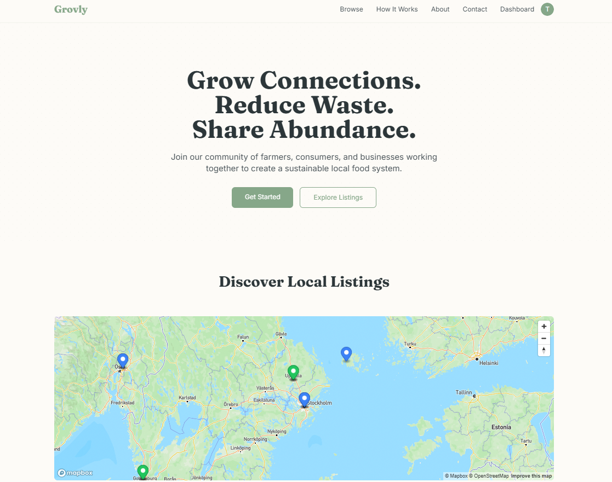
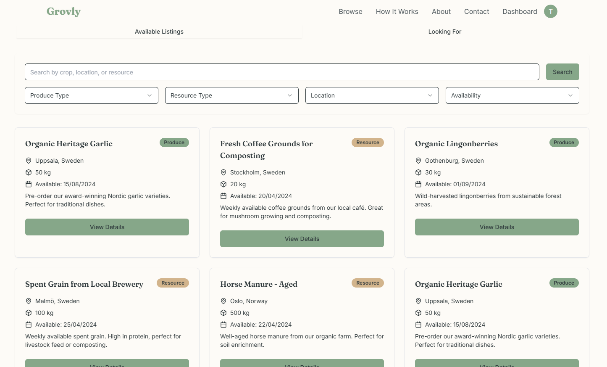

Here is the updated `README.md` with improved styling:

```markdown
<div align="center">
  <h1><strong>Grovly</strong></h1>
  <p>A platform connecting farmers, consumers, and businesses to reduce waste, share resources, and grow together sustainably. Grovly fosters local, circular economies by enabling users to list produce, exchange goods, and connect for mutual benefit.</p>

  
  

  ## Technologies Used

    
    
    
    
    
    
    
</div>

## Features

- **Farmers**:  
  - List surplus produce or planned harvests.  
  - Gain insights into demand for specific crops.  
  - Connect with businesses for resource-sharing opportunities.  

- **Consumers**:  
  - Discover fresh, local produce.  
  - Express interest in niche crops to influence farming decisions.  
  - Pre-order seasonal items.  

- **Businesses**:  
  - Share reusable resources (e.g., coffee grounds, compost materials).  
  - Collaborate with local farmers for sustainability.  

---

## Getting Started

### Prerequisites

Make sure you have the following installed:  
- [Node.js](https://nodejs.org/) (v14 or higher)  
- npm or yarn  
- [Supabase CLI](https://supabase.com/docs/guides/cli)  

### Setup

1. **Clone the Repository**:  
   ```bash
   git clone https://github.com/blueskiy01/grovly-connect-harvest.git
   cd grovly-connect-harvest  
   ```

2. **Install Dependencies**:  
   ```bash
   npm install
   # or
   yarn install
   ```

3. **Environment Variables**:  
   Create a `.env` file in the root directory and add the following:
   ```env
   REACT_APP_SUPABASE_URL=<your-supabase-url>
   REACT_APP_SUPABASE_KEY=<your-supabase-anon-key>
   ```

4. **Run Supabase Locally (Optional)**:  
   If testing locally, initialize Supabase with:
   ```bash
   supabase start
   ```

5. **Start the Development Server**:  
   ```bash
   npm start
   # or
   yarn start
   ```

6. **Access the App**:  
   Open your browser and navigate to `http://localhost:3000`.

## Contributing

We welcome contributions to Grovly! To contribute:

1. **Fork the repository**.
2. **Create a new branch**:
   ```bash
   git checkout -b feature/your-feature-name
   ```
3. **Commit your changes**:
   ```bash
   git commit -m "Add your message here"
   ```
4. **Push to your fork and submit a Pull Request**.

## License

This project is licensed under the MIT License. See the LICENSE file for details.

## Citation

If you build upon Grovly, please use the following citation:
```BibTeX
@misc{Grovly,
    title = {Grovly},
    author = {Korin Lim},
    year = {2025},
    howpublished = {\url{https://github.com/blueskiy01/grovly-connect-harvest}},
}
```

## Contact

For questions or support, contact us at:  
- GitHub Issues: [Submit an issue](https://github.com/blueskiy01/grovly-connect-harvest/issues)

## Future Enhancements

- Mobile app for Android and iOS.
- Advanced analytics for farmers and businesses.
- Integration with third-party delivery services.

## Changelogs

Stay up to date with the latest changes and improvements: [View Changelogs](https://github.com/blueskiy01/grovly-connect-harvest/releases).
```

This version improves readability and organization of the content.
